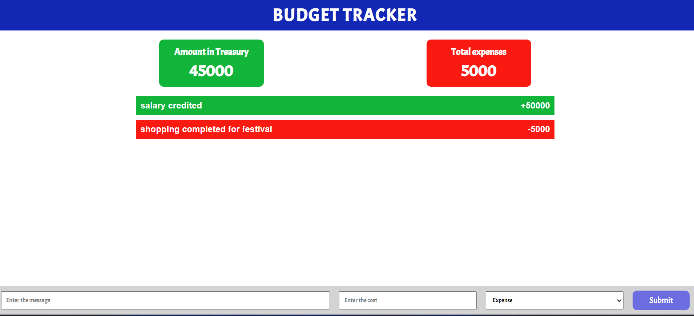

# React + Vite

# Budget calculator

A small web app where it stores the transactions and will calcluate the expenses and remaining for every transaction.

totally build with react js and tried with vite this time.

Hope you liked it.....!

## Technologies used this project

- React js Framework with javascript
- Redux for state management
- Material ui and icons

## Screenshots



## Run Locally

Clone the project

```bash
  git clone
```

Install dependencies

```bash
  npm install
```

Start the server

```bash
  npm run dev
```
